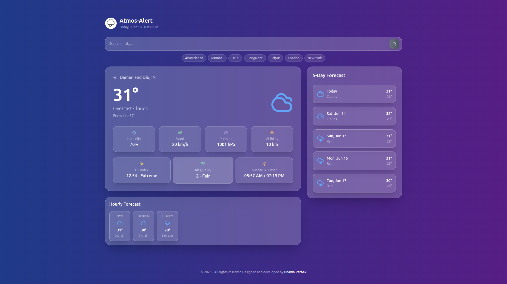

# 🌤️ Atmos alert weather app

A modern, responsive weather application built with React that provides current weather conditions and forecasts using the OpenWeatherMap API.



## ✨ Features

- 🌡️ **Current Weather**: Get real-time weather data for any city
- 📅 **5-Day Forecast**: Extended weather predictions
- 🗺️ **Geolocation Support**: Automatic location detection
- 🔍 **City Search**: Search weather by city name
- 📱 **Responsive Design**: Works on desktop, tablet, and mobile
- 🌙 **Weather Icons**: Beautiful weather condition icons
- ⚡ **Fast Loading**: Optimized performance
- 🔒 **Secure**: Environment variables for API keys

## 📋 Prerequisites

Before you begin, ensure you have the following installed:

- **Node.js** (version 14.0 or higher)
- **npm** (version 6.0 or higher) or **yarn**
- **Git**
- **OpenWeatherMap API Key** (free signup required)

## 🛠️ Installation

### 1. Clone the Repository

```bash
git clone https://github.com/Bhavin-Pathak/atmos-alert.git
cd atmos-alert
```

### 2. Install Dependencies

Using npm:

```bash
npm install
```

## 🔧 Environment Setup

### 1. Get OpenWeatherMap API Key

1. Visit [OpenWeatherMap](https://openweathermap.org/api)
2. Sign up for a free account
3. Navigate to API Keys section
4. Copy your API key

### 2. Create Environment File

Create a `.env` file in the project root directory:

```bash
touch .env
```

### 3. Add Environment Variables

Add the following to your `.env` file:

```env
# OpenWeatherMap API Configuration
REACT_APP_WEATHER_API_KEY=your_openweathermap_api_key_here
REACT_APP_WEATHER_BASE_URL=https://api.openweathermap.org/data/2.5
```

## 🏃‍♂️ Running the Application

### Development Mode

```bash
npm start
```

Open [http://localhost:3000](http://localhost:3000) to view it in your browser.

## 🌐 API Reference

### OpenWeatherMap API Endpoints Used

#### Current Weather

```
GET /weather?q={city}&appid={API_KEY}&units=metric
```

#### 5-Day Forecast

```
GET /forecast?q={city}&appid={API_KEY}&units=metric
```

#### Weather by Coordinates

```
GET /weather?lat={lat}&lon={lon}&appid={API_KEY}&units=metric
```

### WeatherAPI Class Methods

```javascript
// Get current weather by city name
await weatherAPI.getCurrentWeather("Vapi");

// Get 5-day forecast
await weatherAPI.getForecast("Sagwara");

// Get weather by coordinates
await weatherAPI.getWeatherByCoords(51.5074, -0.1278);

// Search cities
await weatherAPI.searchCities("Daman");
```

## 🛠️ Technologies Used

- **Frontend:**

  - React 18
  - JavaScript (ES6+)
  - Tailwindcss
  - HTML5

- **APIs:**

  - OpenWeatherMap API

- **Tools:**

  - Create React App
  - npm/yarn
  - Git

2. **Additional Weather Data:**

   - Humidity
   - Wind Speed
   - UV Index
   - Air Quality

## 📞 Support

If you have any questions or need help, please:

1. Check the [Issues](https://github.com/Bhavin-Pathak/atmos-alert/issues) page
2. Create a new issue if your problem isn't already reported
3. Contact: bhavinpathak29@gmail.com

## 📄 License

This project is licensed under the MIT License - see the [LICENSE](LICENSE) file for details.

## 🤝 Contributing

1. Fork the repository
2. Create your feature branch (`git checkout -b feature/AmazingFeature`)
3. Commit your changes (`git commit -m 'Add some AmazingFeature'`)
4. Push to the branch (`git push origin feature/AmazingFeature`)
5. Open a Pull Request
6. Follow React best practices
7. Use functional components with hooks
8. Write clean, commented code
9. Add tests for new features
10. Update documentation

## ⭐ If you found this project helpful, please give it a star!
